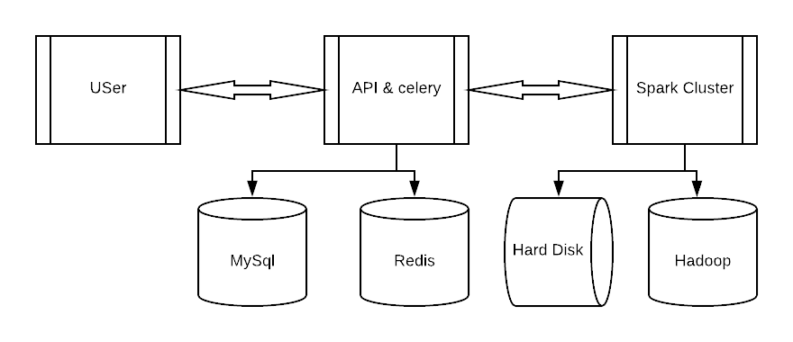
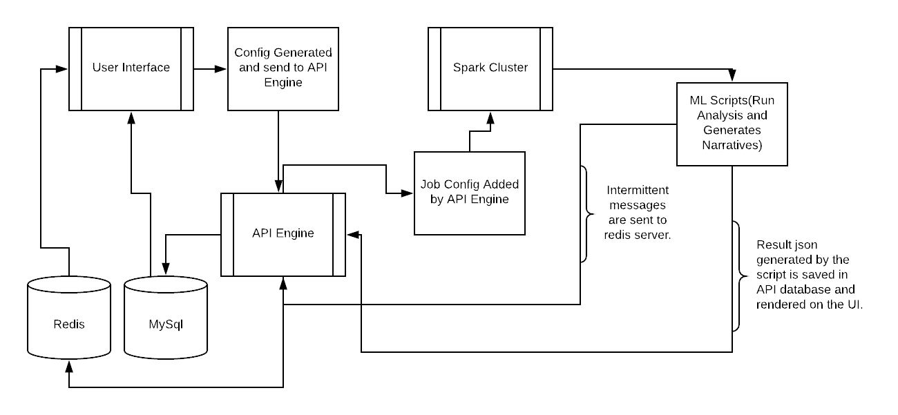

## Updated on 17/July/2018


1. ** Job Types** :

    jobType:
    + *--metaData*: Metadata Generation for a dataset.
    + *--story*: Run Measure or Dimension analysis on the supplied dataset.
    + *--training*: ML Model training.
    + *--prediction*: ML Model Predictions for the trained models.
    + *--stockAdvisor*: Custom application for stock Analysis
    + *--testCase*: Evaluating test cases.

2. ** Analysis Types**:

    analysistype:
    + **--measure**: Measure Analysis when the target Variable is Measure type.
        + **_overview => Descriptive analysis_**:
            * Descriptive analysis of the target variable.
        + **_trend => Trend_**:
            * Trend analysis.
        + **_performance => Measure vs. Dimension_**:
            * Anova Analysis.
        + **_influencer => Measure vs. Measure_**:
            * Linear regression.
        + **_prediction => Predictive modeling_**:
            * Decision Tree.

    + **--dimension**: Dimension Analysis when the target Variable is Dimension type.
        + **_overview => Descriptive analysis_**:
            * Descriptive analysis of the target variable.
        + **_trend => Trend_**:
            * Trend Analysis.
        + **_performance => Measure vs. Dimension_**:
            * Chi-Square analysis.
        + **_prediction => Predictive modeling_**:
            * Decision Tree.

3. ** Directory Structure**:

    mAdvisor-MLScripts:
    + **_bi_**
        + **_algorithms_**:
            * Contains Scripts for ML algorithms and utils.
        + **_common_**:
            * Generic Classes for card structures,charts,models etc.
        + **_narratives_**:
            * Narrative Generation classes for different analysis.
        + **_parser_**:
            * Parser class for the config file used.
        + **_scripts_**:
            * Scripts to Trigger the Job submitted through Config.
        + **_settings_**:
            * Global Settings and configs.
        + **_sparkjobs_**:
            * Wrapper for calling the master script.
        + **_stats_**:
            * Scripts for various statistical analysis.
        + **_templates_**:
            * Jinja2 templates for generating narratives.
        + **_transformations_**:
            * DataFrame transformations like binning,subsetting scripts.
        + **_tests_**:
            * Test cases for different analysis.

4. ** Codebase Setup**:

    mAdvisor-MLScripts:

    + clone the repository on local machine.
    + go to bi->settings->configs->
    + run following commands
        * mkdir localConfigs
        * cp -r sampleConfigs/* localConfigs/.
            + copies all files from sampleConfigs directory to localConfigs
    + Now make changes in the config files in localConfigs directory.


5. ** Bug Debugging/Resolution Process**:

    + **_Environment Identification_**:
        * Identify which environment has the mentioned bug.
    + **_Checkout to the deployed Branch_**:
        * Checkout the branch that is deployed on the identified Environemnt.
    + **_Config_**:
        * Get the config json from the Environment admin dashboard.
        * find and replace all
            * null => None
            * true => True
            * false => False
    + **_Run the config in Local Environment_**:
        * find the jobType from the config.
        * go to the corresponding config in bi->settings->configs->localConfigs
        * replace the copied config.
        * run spark-submit bi/master.py <-random text->
    + **_Debug and Resolve_**:
        * identify the error from the print logs and debug the issue.
        * once resolved test the output from the UI.
        * deploy the code.

6. ** Deployment Process**:

    + **_Environment Identification_**:
        * Identify in which environment code has to be deployed.
    + **_Branch Checkout_**:
        * Checkout the branch that is to be deployed on the identified Environemnt.
    + **_SSH Celery Server_**:
        * ssh to the machine where environment celery is running .
        * go to the corresponding screen
    + **_Egg file creation_**:
        * go to the mAdvisor-MLScripts directory
        * Run following command.
            * python setup.py bdist_egg
    + **_Egg file deployment_**:
        * copy the .egg file generated in mAdvisor-MLScripts -> dist directory
        * paste the .egg file to mAdvisor-api -> scripts directory


7. ** Config Structure **:

    ```
    Config is the sole point of contact for API and ML Scripts.
    This is a sample comprehensive config structure.
    for detail config structure check bi->settings->configs->sampleConfigs directory
    {
      "config": {
        "COLUMN_SETTINGS": {
          ...
        },
        "DATA_SOURCE": {
          ...
        },
        "ADVANCED_SETTINGS": {
          ...
        },
        "FILE_SETTINGS": {
          ...
        },
        "FILTER_SETTINGS": {
          ...
        },
        "TRANSFORMATION_SETTINGS": {
          ...
        },
        "DATE_SETTINGS": {
          ...
        }

      },
      "job_config": {
        "message_url": "...",
        "get_config": {
        },
        "error_reporting_url": "...",
        "set_result": {
          ...
        },
        "job_url": "...",
        "job_type": "story",
        "job_name": "anovaTest",
        "xml_url": "...",
        "app_id": None
      }
    }
    ```
    + **job\_config**: configuration settings for Interacting with the API layer
        + **message\_url**:
            * API where messages are pushed.
        + **job\_url**:
            * API to store final result json.
        + **xml\_url**:
            * API to save trained ML model pmml files.
        + **error\_reporting\_url**:
            * API to save the captured error Log.
        + **job\_type**:
            * one of the many JobTypes mentioned in section 1.
        + **job\_name**:
            * Name of the Job submitted.
        + **app\_id**:
            * App ID of the custom Applications.
        + **set\_result**:
            * some extra details for saving the result Json.
        + **get\_config**:
            * redundant key

    + **config**:
        + **COLUMN\_SETTINGS**:
            * configuration details of each column in the data.
        + **DATA\_SOURCE**:
            * Details about the data source i.e csv file for some database.
        + **FILE\_SETTINGS**:
            * filepath when Data Source is a csv file .
            * "" when Data Source is some Database
        + **FILTER\_SETTINGS**:
            * details about the filter operations being performed on various columns.
        + **TRANSFORMATION\_SETTINGS**:
            * details about any transformations being applied on various columns.
            * transformations such as delete,change\_datatype,rename,replace etc.
        + **DATE\_SETTINGS**:
            * details about all date columns detected and their date formats.
        + **ADVANCED\_SETTINGS**:
            * details of some algorithm specific settings.


8. ** API/UI Interaction **:

    * All communications with the api is being handled through the job_config details.
    * There are a total of 4 different kind of Interactions with the API
    * Wrapper functions for these APIS are in bi->common->utils.py

        + **message\_url**:
            * API where messages are pushed.
            * wrapper function name : **save\_progress\_message**
        + **job\_url**:
            * API to store final result json.
            * wrapper function name : **save\_result\_json**
        + **xml\_url**:
            * API to save trained ML model pmml files.
            * wrapper function name : **save\_pmml\_models**
        + **error\_reporting\_url**:
            * API to save the captured error Log.
            * wrapper function name : **save\_error\_messages**

9. **Enviroment+servers+Deployed branches**:


| Environemnt Name  | Branch Deployed | Celery Server |
| :---:             |     :---:       |          ---: |
| dev               | configRevamp    |               |
| production        | master          |               |
| webinar           | master          |               |
| staging           | staging         |               |
| cwpoc             | cwpoc           |               |


10. **Architecture Diagram**:




11. **WorkFlow Diagram**:



